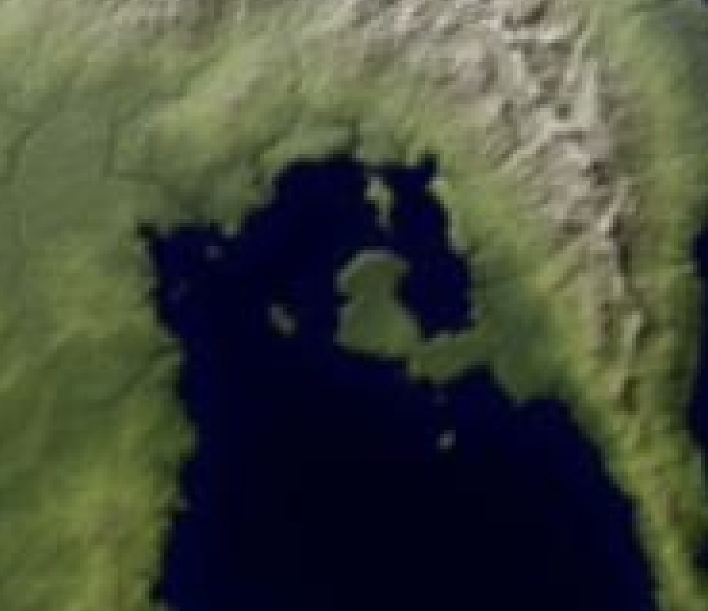
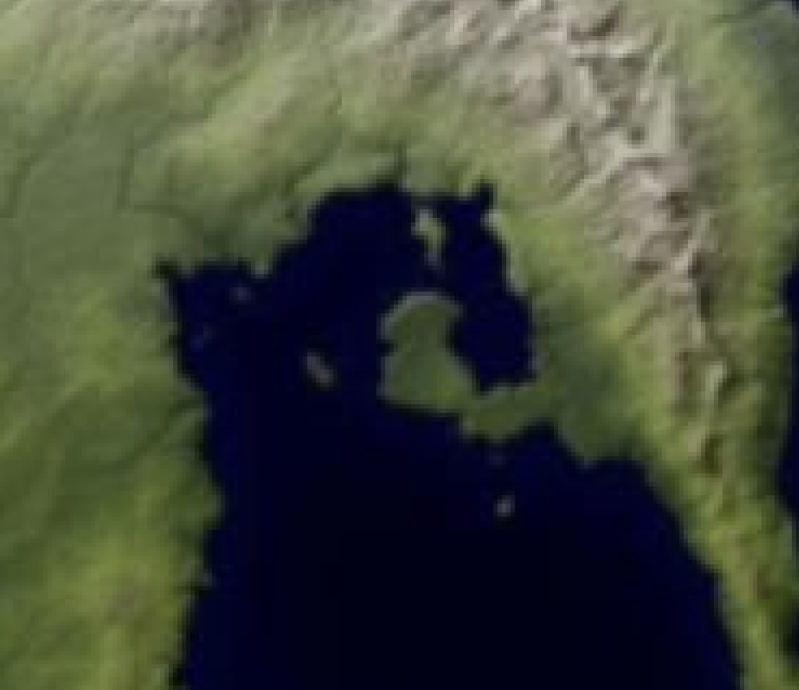
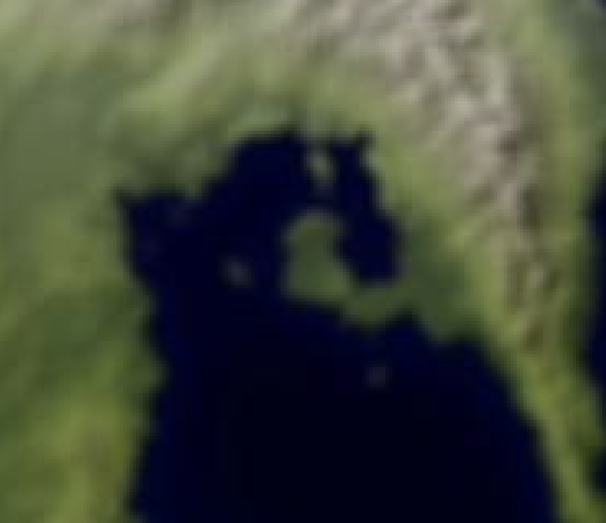
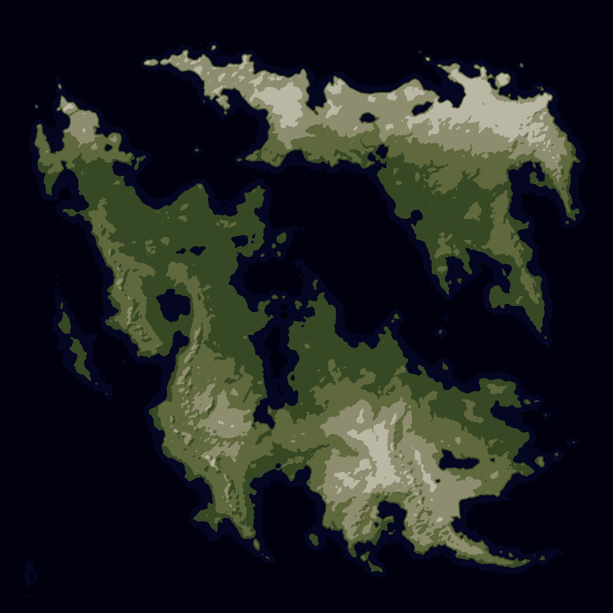
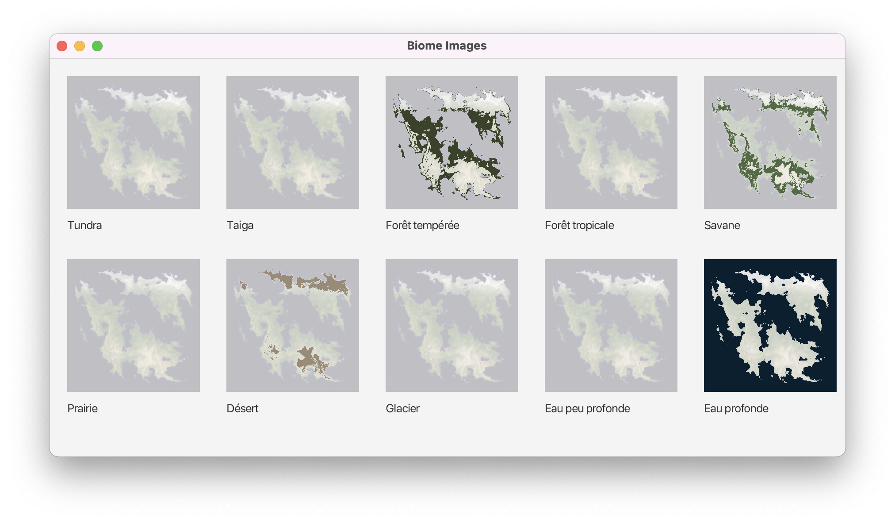

# Rapport - Projet IA

> CHAIX Maxence - MARI Farid - BOURDON Marin - ROTH Tristan - COLLIN Alex - AIL2
> 

# 1 - Prétraitement de l’image

### Objectif

L'objectif de ce prétraitement est de faire ressortir les grandes zones de couleurs similaires sur une carte.

### Méthodologie

Pour atteindre cet objectif, nous avons comparé deux types de flou : le flou par moyenne et le flou gaussien. Deux classes ont été implémentées, `FlouParMoyenne` et `FlouGaussien`, qui respectent une interface commune `Flou`.

### Expérimentation

Nous avons utilisé un programme principal (`main`) pour appliquer ces méthodes de floutage à l'image, nous permettant ainsi de tester différents paramètres facilement. Voici les résultats obtenus pour chaque méthode :

### **Flou par moyenne :**

- **Taille 3 :**
    
    
    
- **Taille 7 :**
    
    
    

### Flou Gaussien :

- **Taille 5, écart-type 1 :**
    
    
    
- **Taille 7, écart-type 1 :**
    
    
    
- **Taille 7, écart-type 3 :**
    
    
    

### Analyse des résultats

Sur les images obtenues, les flous avec des paramètres plus petits n'ont pas donné des résultats concluants. Les méthodes les plus efficaces pour notre objectif sont le flou par moyenne avec une taille de 7 et le flou gaussien avec une taille de 7 et un écart-type de 3.

### Choix de la méthode

Nous avons opté pour le flou gaussien avec une taille de 7 et un écart-type de 3, car cette méthode permet de mieux délimiter les frontières entre les biomes sur la carte par rapport au flou par moyenne.

# 2 - Détection et visualisation des biomes

## 2.1 - Détection des groupes de pixels de couleur similaire

### Introduction

Les biomes sont définis comme des zones de la carte ayant des couleurs similaires. Pour identifier ces zones, nous avons exploré l'utilisation d'algorithmes de clustering, qui regroupent les pixels en fonction de la similarité de leurs couleurs. Ce rapport présente notre approche, les choix d'algorithmes et d'autres considérations pertinentes.

### Méthodologie

1. **Choix de l'Algorithme de Clustering :**
Nous avons implémenté une interface `AlgoClustering` avec trois classes concrètes : `KMeansClustering`, `HACClustering` (Hierarchical Agglomerative Clustering), et `DBSCANClustering` (Density-Based Spatial Clustering of Applications with Noise). Après des tests préliminaires, nous avons choisi de ne pas utiliser HAC et DBSCAN en raison de la durée d’exécution interminable dû au nombre élevé de pixels.
2. **Choix de la Métrique de Similarité :**
Pour calculer la similarité entre les couleurs des pixels, nous avons utilisé la distance euclidienne dans l'espace RGB. Cette métrique est couramment utilisée et efficace pour notre tâche.
3. **Choix des Paramètres du Clustering :**
Pour `KMeansClustering`, nous avons testé plusieurs valeurs de nombre de clusters (`k`). Nous avons sélectionné deux configurations : 6 et 10 clusters, en fonction des résultats visuels et de l'homogénéité des clusters obtenus.
4. **Évaluation de la Qualité du Résultat :**
L'évaluation s'est principalement basée sur une validation visuelle, où chaque pixel de la carte a été remplacé par la couleur moyenne de son cluster. Cette méthode permet de vérifier la capacité des clusters à regrouper les zones de couleurs similaires.

### Résultats

### Utilisation de K-Means Clustering

- **6 Clusters :**
    
    
    
- **10 Clusters :**
    
    
    

### Choix Final et Justification

Après avoir comparé les résultats obtenus avec différentes configurations de K-Means, nous avons choisi de continuer avec 10 clusters. Cette configuration offre une meilleure distinction entre les différentes nuances de couleurs sur la carte, facilitant ainsi l'identification précise des biomes.

## 2.2 - Étiquetage des biomes

Pour attribuer des étiquettes aux biomes, nous avons mis en place une méthode qui calcule la distance entre la couleur moyenne de chaque cluster et les couleurs des biomes prédéfinis. Voici le processus détaillé :

- **Calcul de la couleur moyenne du cluster** : Pour chaque cluster identifié par l'algorithme de clustering (par exemple, K-means), nous calculons la couleur moyenne des pixels qui lui sont assignés.
- **Calcul de la distance aux couleurs de biome** : Nous calculons la distance entre la couleur moyenne du cluster et les couleurs prédéfinies des biomes (par exemple, Tundra, Forêt tropicale, etc.). La distance peut être mesurée selon diverses normes de distance couleur, comme la distance euclidienne dans l'espace RGB ou des espaces colorimétriques plus complexes comme CIELAB.
- **Attribution du biome le plus proche** : Chaque cluster est associé au biome dont la couleur prédéfinie est la plus proche de sa couleur moyenne. Si plusieurs clusters sont associés au même biome, cela signifie qu'ils sont similaires en couleur et peuvent être regroupés ensemble pour former un seul cluster représentant ce biome.

## 2.3 - Affichage des différents biomes

Pour visualiser les différents biomes sur une carte, voici la méthodologie utilisée :

- **Création d'un fond de carte** : Nous commençons par ajouter un filtre à l'image originale pour créer un fond de carte qui servira de base pour superposer les pixels des biomes.
- **Création des images de biomes** : Pour chaque cluster associé à un biome spécifique, nous créons une nouvelle image qui combine le fond de carte avec les pixels du cluster colorés selon la couleur spécifique du biome. Ainsi, chaque image de biome montre les zones correspondantes sur la carte, distinguées par leur couleur caractéristique.
    
    
